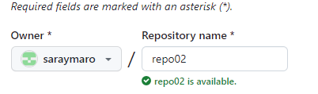
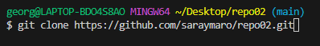
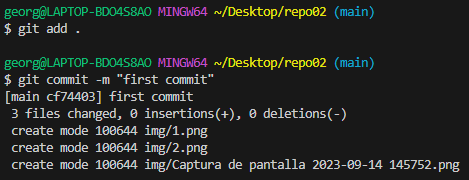

# Ejercicio 2
👉Crea un repositorio llamado repo02 desde GitHub. ¿Sería considerado un repositorio
local o remoto?
>
Como vemos en la imagen creamos un nuevo repositorio desde github y aprovechamos para hacer click en "Add Readme" ya que asi se nos crea este documento automaticamente. El repositorio en el momento de crearlo en github se considera repositorio remoto.

👉Posteriormente, clónalo (mediante al comando git clone), lo que realizará una copia
del repositorio remoto en nuestro equipo, creando con ello un repositorio local a partir del
repositorio en remoto.
>
Para clonar el repositorio añadimos el comando que se ve en la imagen y dejamos que se ejecute. Posteriormente, con "cd + el nombre del repositorio" entraras en el.

👉Añade un fichero readme.md y ejecuta los comandos pertinentes hasta llegar a poder
realizar un commit.
>En nuestro caso, habíamos añadido el readme.md desde el repositorio al crearlo, pero en caso de no haberlo hecho hacemos click en "New File" y escribimos "readme.md" y con esto ya estará creado. Posteriormente, como se ve en la imagen, hacemos commit.

Una vez hecho esto, ya habremos completado el ejercicio.
